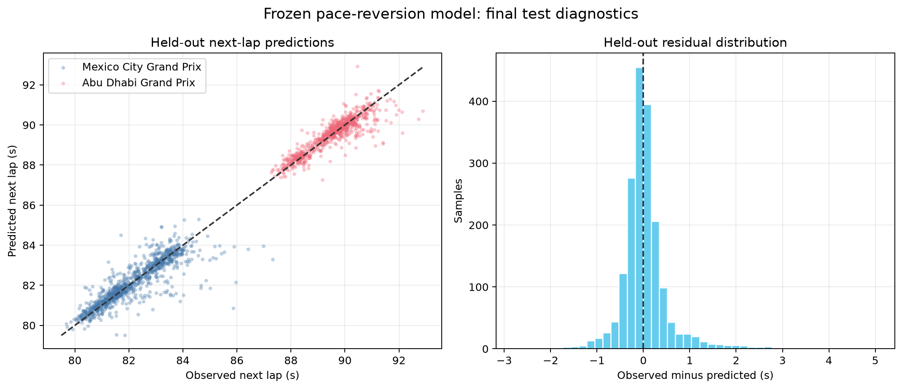
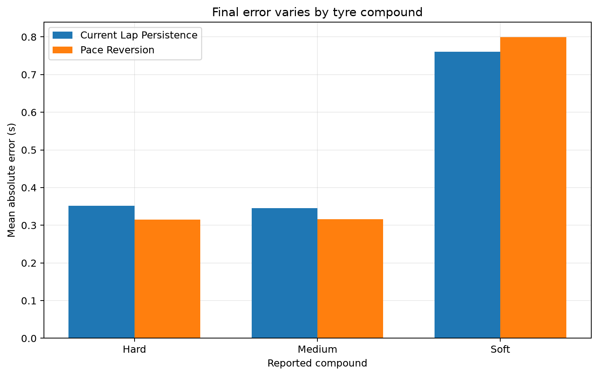
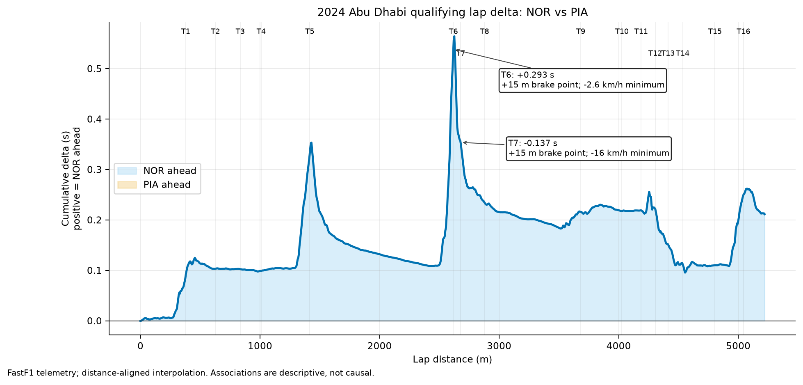

# Motorsport Telemetry Project

[](https://github.com/ChamikaNimsara/telemetry-project/actions/workflows/quality.yml)

A reproducible FastF1 portfolio project that estimates the next eligible clean
lap time and uses that prediction to describe tyre-stint pace change. It is
designed for a race-performance analyst reviewing an unseen event—not as a live
pit-wall or safety-critical system.

The version 1 result is an interpretable pace-reversion model evaluated once on
two fully held-out 2024 races. It achieved **0.3177 s macro-event MAE**, compared
with **0.3499 s** for the stronger final baseline: a **9.22% improvement**. The
method improved on the baseline in both held-out events and produced no
predictions outside the project’s 30–300 s validity range.

> This project estimates observed lap-time performance, not physical tyre wear.
> It is an unofficial educational analysis and is not affiliated with or
> endorsed by Formula 1, its teams, or FastF1.

## Why this problem matters

Tyre performance is central to stint and strategy decisions, but public data
does not expose physical tyre condition. The project therefore uses a narrower,
testable question: given information available at the end of a clean race lap,
how accurately can the next consecutive eligible lap time be estimated?

That framing keeps the target observable and the evaluation honest. It also
supports an engineering view of expected pace change as reported tyre age
increases without claiming that the relationship is causal degradation.

Read the complete [problem definition](docs/problem-definition.md),
[data contract](docs/data-dictionary.md), and
[model report](reports/model-report.md) for the precise scope.

## Result at a glance

| Method | Held-out macro-event MAE (s) | Interpretation |
|---|---:|---|
| Pace reversion (selected) | **0.3177** | Conditional median response to the previous lap-time change |
| Current-lap persistence | 0.3499 | Predict the next lap equals the current lap |
| Training-median degradation | 0.3504 | Add a development-only compound/tyre-age median change |

The test set contains 1,839 eligible lap pairs from the Mexico City and Abu
Dhabi Grands Prix. Selection used six training and two validation races only;
the test events were opened after the method and gates were frozen.



*Figure 1. Observed versus pace-reversion predictions for the two held-out
events, in seconds. The close diagonal fit includes both small routine changes
and less frequent larger errors.*



*Figure 2. Held-out MAE by compound. Hard and medium performance is stable;
the soft estimate is based on only 25 samples and should not be generalized.*

## Race performance analysis

The predictive project is complemented by a focused engineering case study:
Lando Norris versus Oscar Piastri on their fastest accurate laps in 2024 Abu
Dhabi qualifying. Norris recorded 1:22.595, **0.209 s** faster than Piastri's
1:22.804.

The workflow distance-aligns speed, throttle, brake, gear, RPM, and DRS; builds
a signed cumulative lap-delta trace; and summarizes 16 configured corner
windows plus 21 fixed 250 m mini-sectors. The strongest positive corner-window
contribution for Norris is T6 (+0.293 s), associated with a 15 m later derived
brake marker but a 2.6 km/h lower minimum speed. The strongest loss is T7
(-0.137 s). Because those corners are only 60.6 m apart, their configured
windows should be read together: the linked T6–T7 complex nets +0.156 s to
Norris. These are telemetry associations for investigation—not claims about
setup, causality, or persistent driver performance.



*Figure 3. Cumulative comparison-minus-reference elapsed-time delta. Positive
values mean Norris is ahead; annotations identify the largest corner-window gain
and loss with their measured supporting differences.*

Read the full [race performance analysis](reports/race-performance-analysis.md)
or the one-page [engineer's brief](reports/engineering-brief.md). The
[corner table](reports/tables/qualifying-corner-comparison.csv) exposes minimum
speed, braking, throttle-pickup, and time-delta calculations for every corner.

## Method and evaluation design

The pipeline acquires ten 2024 race sessions, retains dry and accurate slick-tyre
laps outside pit and disrupted-status transitions, and constructs targets only
from immediately consecutive eligible laps within a driver stint. The resulting
9,682 samples are grouped by whole event:

- train: six races and 5,431 samples;
- validation: two races and 2,412 samples;
- final test: two races and 1,839 samples.

The selected pace-reversion method places the observed current-versus-previous
lap change into one of ten frozen bands. It adds the development median next-lap
change for that band to the current lap, with a global development median when
history is unavailable. No future-lap value is used as an input.

The primary metric is unweighted macro-event mean absolute error (MAE), so a
large race cannot dominate selection. Secondary evidence includes RMSE, median
absolute error, signed error, per-event results, condition breakdowns, and a
physical-range check. Candidate selection and final evaluation are recorded in
versioned configurations and manifests.

## Reproduce the project

### Requirements

- [uv 0.12.13](https://docs.astral.sh/uv/getting-started/installation/)
- Git

Python 3.12 is pinned in `.python-version`; uv can install it automatically.
No API key is required for FastF1.

### Install and verify

From the repository root:

```shell
uv python install 3.12
uv sync --locked --dev
uv run python -m telemetry_project.cli --version
uv run pytest
```

The committed `uv.lock` fixes the complete cross-platform environment. Keep it
synchronized with `pyproject.toml`; update it intentionally with `uv lock` only
when dependencies or package metadata change.

### Run the end-to-end workflow

The first two commands require network access and create local FastF1 cache and
processed files that are excluded from Git. Subsequent commands verify the
recorded hashes before using those files.

```shell
# 1. Acquire and validate the ten configured 2024 races
uv run python -m telemetry_project.cli acquire

# 2. Clean, audit, create time-valid features, and freeze grouped splits
uv run python -m telemetry_project.cli build-dataset

# 3. Recreate development-only analysis and figures
uv run python -m telemetry_project.cli analyze-data

# 4. Recreate validation baselines and candidate comparison
uv run python -m telemetry_project.cli evaluate-baselines
uv run python -m telemetry_project.cli select-model

# 5. Verify and recreate the frozen final evaluation
uv run python -m telemetry_project.cli evaluate-final

# 6. Recreate the focused qualifying telemetry comparison
uv run python -m telemetry_project.cli analyze-performance

# 7. Audit the public release candidate
uv run python -m telemetry_project.cli release-audit
```

PowerShell users can run the same commands unchanged on one line. Use
`build-dataset --offline` after a successful online build to prove the required
source responses are cached. The first full acquisition may take several
minutes depending on FastF1 availability and network speed.

`analyze-performance` downloads the configured qualifying telemetry on its first
run and then supports `--offline` reproduction from the local cache. Change the
drivers or event only through `configs/race-performance.yaml`; corner distances
must be reviewed for the selected circuit rather than silently reused.

To check one smaller session before the full workflow:

```shell
uv run python -m telemetry_project.cli smoke-fastf1 --year 2024 --event Bahrain --session R
uv run python -m telemetry_project.cli acquire --only-event Bahrain
uv run python -m telemetry_project.cli acquire --only-event Bahrain --offline
```

Set `TELEMETRY_CACHE_DIR` or pass `--cache-dir PATH` to acquisition and dataset
commands to override the default `data/raw/fastf1-cache/` location. Copy
`.env.example` only if your shell or tooling loads environment files; Python
does not load it automatically.

### Quality checks

Run the same core checks as continuous integration:

```shell
uv lock --check
uv run ruff format --check .
uv run ruff check .
uv run mypy src tests
uv run pytest
uv run python -m telemetry_project.cli release-audit
```

Tests use local fakes rather than the external FastF1 service. The release audit
checks required public files, tracked-content policy, file sizes, high-confidence
secret patterns, private absolute paths, local Markdown links, notebook output,
and version consistency.

## Evidence map

| Claim or question | Reproducible evidence |
|---|---|
| Why this target and user were selected | [Problem definition](docs/problem-definition.md) and [feasibility study](reports/feasibility-study.md) |
| Which events and source fields were used | [Event configuration](configs/events.yaml), [event manifest](data/manifests/event-manifest.json), and [data sources](docs/data-sources.md) |
| How laps were cleaned and split | [Data dictionary](docs/data-dictionary.md), [data-quality report](reports/data-quality-report.md), and [split manifest](data/manifests/split-manifest.json) |
| What development data showed | [Exploratory analysis](reports/exploratory-analysis.md) and figures 01–04 under `reports/figures/` |
| Why pace reversion was selected | [Candidate metrics](reports/candidate-validation-metrics.json) and [selection manifest](reports/model-selection-manifest.json) |
| How the final result compares | [Final metrics](reports/final-test-metrics.json), [per-event table](reports/tables/final-test-by-event.csv), and [model report](reports/model-report.md) |
| Where qualifying lap time is gained or lost | [Race performance analysis](reports/race-performance-analysis.md), [engineer's brief](reports/engineering-brief.md), and [analysis manifest](reports/race-performance-manifest.json) |
| Whether the repository is release-ready | [Release checklist](docs/release-checklist.md) and [machine-readable audit](reports/release-audit.json) |

## Repository layout

```text
configs/                    Frozen data, analysis, and modelling configuration
data/manifests/             Source and split provenance (no row-level data)
docs/                       Scope, schema, sources, and release documentation
reports/                    Aggregate evidence, narrative, tables, and figures
src/telemetry_project/      Typed, reusable pipeline and CLI implementation
tests/                      Unit, integration, leakage, and CLI tests
```

Raw source data, processed row-level data, predictions, caches, environments,
credentials, model binaries, and generated noise are excluded from version
control. Only compact aggregate evidence needed to audit the published claims is
committed.

## Limitations

- The held-out evaluation covers only Mexico City and Abu Dhabi in the 2024
  regulation period; two events are insufficient for a stable population
  confidence interval.
- The method mostly captures short-term pace reversion. It does not isolate
  physical tyre wear from fuel load, traffic, circuit, weather, track evolution,
  team, or driver effects.
- Deliberately excluded safety-car, pit-transition, wet, inaccurate, and
  non-consecutive laps are outside the evidence.
- Soft-compound test performance is based on 25 samples and is worse than the
  persistence baseline; it is a visible failure mode, not a supported claim.
- Public-source fields can be corrected, incomplete, delayed, or inconsistent.
  This project is analytical support only and is unsuitable for live or
  safety-critical decisions.
- The qualifying comparison is a two-lap observational case study. Its derived
  brake and throttle markers have 5 m grid resolution, and public data cannot
  isolate setup, tyre temperature, wind, tow, or energy-deployment effects.

See the [model report](reports/model-report.md) for detailed event and condition
results and the [retrospective](reports/retrospective.md) for the prioritized
next iteration.

## Data use, license, and attribution

The project uses [FastF1](https://github.com/theOehrly/Fast-F1) 3.8.3 to access
timing, lap, session, and weather data. FastF1 is unofficial and combines
several sources. Its software license does not grant redistribution rights to
the underlying Formula 1 timing data.

The source code and original project documentation are available under the
[MIT License](LICENSE). That license does **not** apply to Formula 1, FastF1, or
other third-party data, names, marks, or content. Raw and row-level derived data
remain local. Review [the data-use controls](docs/data-sources.md) before
acquiring, publishing, or reusing data-derived material.

Contributions should follow [CONTRIBUTING.md](CONTRIBUTING.md). Citation
metadata is provided in [CITATION.cff](CITATION.cff).
