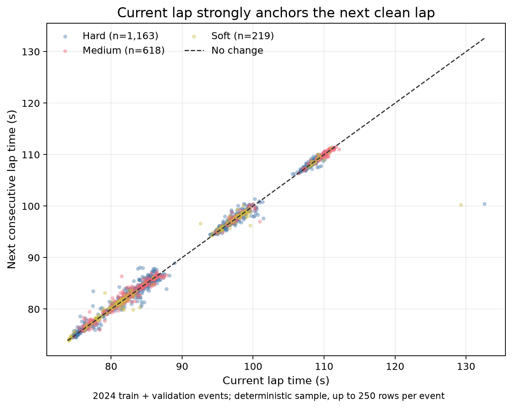
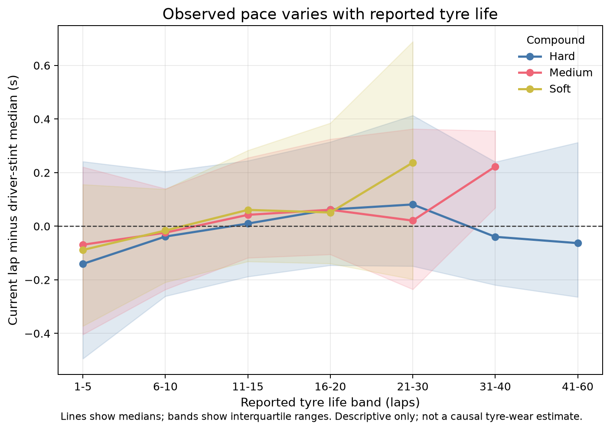
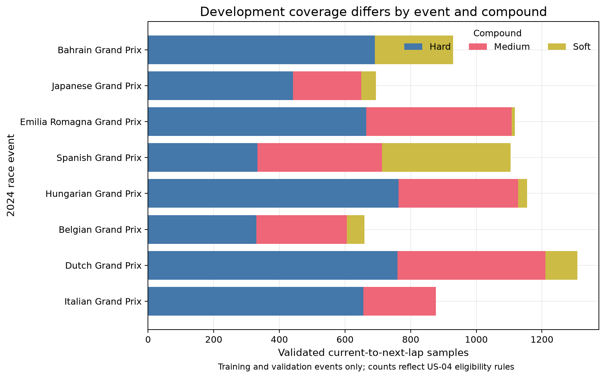
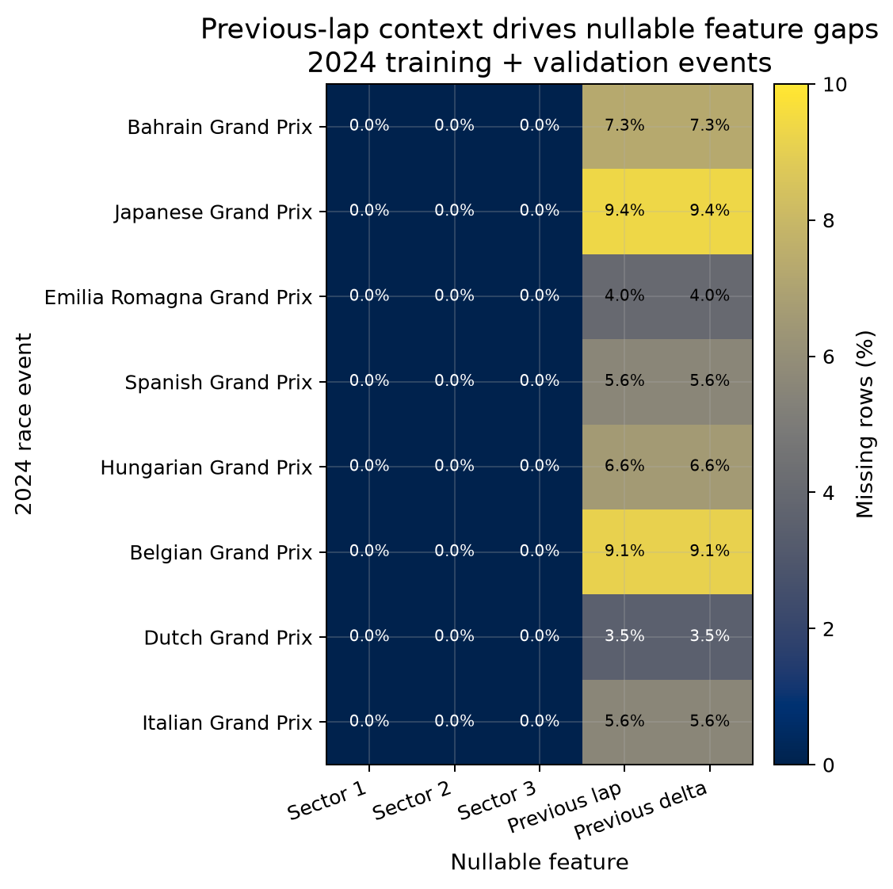

# Exploratory Motorsport Analysis

**Analysis version:** 1.0.0
**Dataset SHA-256:** `08705dff594b111da8dd120efb4a70ff7c42673053d4054f67ecef8c3b6d6834`
**Exploration boundary:** training and validation events only; frozen test rows were not loaded

## Engineering Questions

1. How strongly does the completed current lap anchor the immediately next clean lap, and how demanding is the persistence baseline?
2. How does observed within-stint pace vary across reported tyre-life bands and compounds, without treating the association as causal wear?
3. Is development coverage balanced across events and slick compounds?
4. Where are nullable feature gaps concentrated, and what preprocessing constraint follows?

## Scope and Measurement Types

The analysis uses 7,843 validated samples from 8 development events: six training and two validation races. Measured FastF1 fields include lap and sector times, compound, reported tyre life, position, team, and weather. Engineered modelling fields include next-lap and previous-lap deltas. Figure 2 adds an analysis-only driver-stint median centering that uses the complete stint and is forbidden as a prediction feature.

The analysis assumes the US-04 eligibility rules adequately remove wet, pit, inaccurate, deleted, and disrupted laps. Reported tyre life is not direct physical wear, long stints are selected by race strategy and survival, and fuel load, traffic, driver management, car performance, and circuit layout remain plausible confounders.

## Findings

### Q1 — Current-to-next-lap persistence

Current and next clean lap times have Pearson correlation `0.9919`. The descriptive persistence error is 0.424 s MAE overall, ranging from 0.313 s at Bahrain Grand Prix to 0.767 s at Japanese Grand Prix. This supports a strong mandatory persistence baseline; it does not establish model performance.



*Figure 1. Current versus immediately consecutive next-lap time for a deterministic event-balanced sample. The dashed identity line denotes no lap-time change.*

### Q2 — Tyre age and observed pace

Across compound-by-age summaries, the median analysis-only centered pace spans 0.378 s. The direction is not interpreted as a tyre-only effect because fuel burn, traffic, driver pace management, stint selection, circuit, and temperature vary with lap and tyre age.



*Figure 2. Median current lap time relative to each driver-stint median, with interquartile ranges. This post-event centered measure is descriptive and must never enter a predictive feature set.*

### Q3 — Event and compound coverage

The development data contain 4,640 hard, 2,341 medium, and 862 soft samples. Event and compound counts are visibly unequal, so row-weighted aggregate metrics alone would overrepresent common contexts.



*Figure 3. Validated sample counts by development event and compound. Complete events, not individual rows, remain the evaluation groups.*

### Q4 — Nullable feature coverage

All retained sector times are complete, while previous-lap context is missing for 6.01% of development samples, principally the first targetable lap after each eligibility break. Missingness is structural rather than evidence that later laps should be used to fill the gap.



*Figure 4. Per-event missing percentages for fields allowed to be nullable by the dataset contract.*

## Modelling Implications

- Always compare against current-lap persistence, using macro-event MAE as the primary selection metric.
- Before candidate selection, require validation macro-event MAE at least 5% below the stronger fixed baseline, with no validation event degrading by more than 10%.
- Retain current lap time, reported tyre life, compound, current weather, current position, team, and past-only pace context as candidate inputs. Treat driver, team, and event fields as categorical/grouping context rather than numeric magnitudes.
- Exclude `rainfall` and `track_status` from version 1 model inputs because eligibility makes them constant; retain them as scope evidence.
- Never use the analysis-only stint-centered pace, full-stint length, later-lap summaries, or either target column as a feature.
- Fit missing-value handling, categorical encoding, scaling, and any robust outlier thresholds on training events only. Add explicit indicators for structurally missing previous-lap context if used.
- Report per-event results plus compound, tyre-age, team/driver, fresh/used tyre, and temperature subgroups. Use event weighting so high-lap-count races and common hard-tyre samples do not dominate.
- Treat fuel burn, traffic, driver management, circuit, car performance, stint-selection bias, and FastF1 corrections as unresolved confounding or measurement risks. Do not make causal tyre-wear claims.
- Keep the frozen Mexico City and Abu Dhabi test events unopened until the method and numeric success margin are fixed.

## Reproduction

```shell
uv run python -m telemetry_project.cli analyze-data
```

The command verifies each processed split against the US-04 manifest before reading it. Aggregate event evidence is saved in `reports/tables/exploratory-event-summary.csv`; figure and input hashes are recorded in `reports/exploratory-analysis-manifest.json`.
