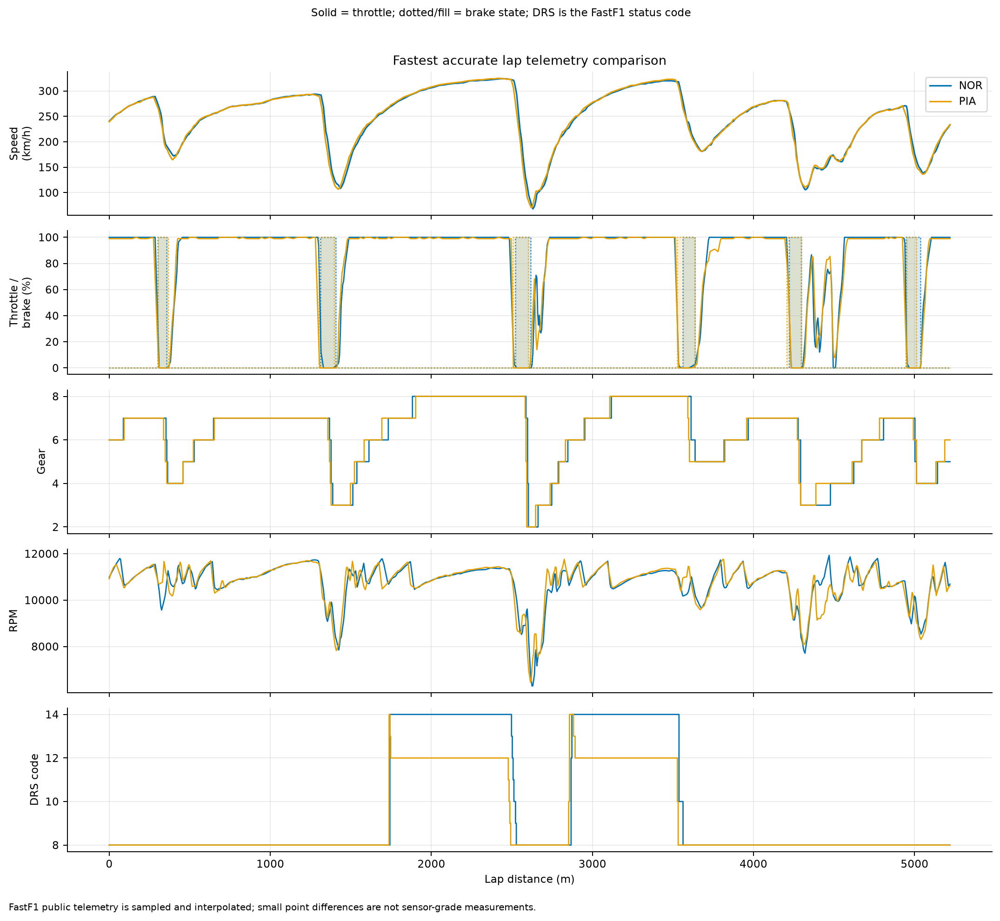
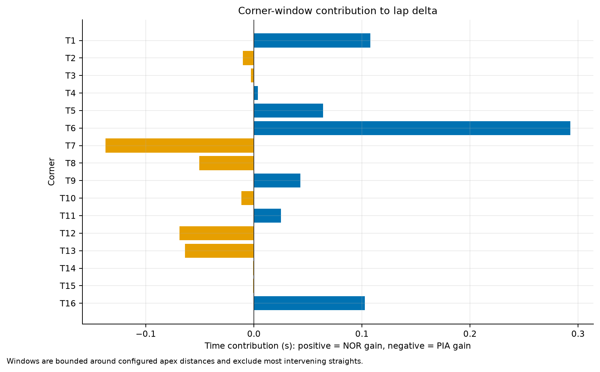

# Race Performance Analysis

## Engineering question

Where did **Lando Norris (NOR)** gain or
lose time relative to **Oscar Piastri
(PIA)** on their fastest accurate qualifying laps at the
2024 Abu Dhabi, and which measured control or
speed differences are associated with those changes?

## Session and method

- Session: 2024 Abu Dhabi Q
- Reference: Lando Norris (NOR),
  lap 15,
  82.595 s, SOFT
- Comparison: Oscar Piastri (PIA),
  lap 15,
  82.804 s, SOFT
- Recorded advantage: **0.209 s to NOR**
- Alignment: linear interpolation on a 5 m distance grid
- Segmentation: 16 configured corner windows and
  21 fixed 250 m mini-sectors

The cumulative delta is comparison elapsed time minus reference elapsed time;
an increasing trace means NOR is gaining. Brake and DRS are
discrete FastF1 status channels. Brake point and throttle pickup are rule-based
markers requiring 3 consecutive samples. They are
diagnostic approximations, not exact physical pedal or GPS measurements.

## Main observations

- The largest positive corner-window contribution is **T6** at
  **+0.293 s**. It is associated with
  15 m later brake application and 2.6 km/h lower minimum speed for Lando Norris.
- The largest negative corner-window contribution is **T7** at
  **-0.137 s** for
  NOR. It is associated with
  15 m later brake application and 16.0 km/h lower minimum speed for Lando Norris.
- The strongest aggregate mini-sector phase for NOR is
  **braking** at
  **+0.355 s**. Phase labels are
  descriptive rules based on sampled brake, throttle, speed, and DRS channels.
- T6 and T7 are only 60.6 m apart. Their windows share a midpoint and should be
  reviewed as one linked complex: together they contribute **+0.156 s**
  to the reference delta, rather than the isolated T6 value alone.

## Corner comparison

The complete table is in
[`tables/qualifying-corner-comparison.csv`](tables/qualifying-corner-comparison.csv).
Positive minimum-speed, later-braking, earlier-throttle, and time-gain values
favor NOR. Blank brake or throttle markers mean the rule did
not find a defensible transition in the configured search window.

| Corner | Class | NOR min (km/h) | PIA min (km/h) | Later braking (m) | Earlier throttle (m) | NOR gain (s) |
|---|---|---:|---:|---:|---:|---:|
| T1 | medium | 172.3 | 164.9 | 0.0 | -10.0 | +0.108 |
| T2 | high | 219.8 | 222.2 | 0.0 |  | -0.010 |
| T3 | high | 266.9 | 266.7 |  |  | -0.003 |
| T4 | high | 275.0 | 275.6 |  | 0.0 | +0.004 |
| T5 | low | 108.4 | 107.0 | 10.0 | -10.0 | +0.064 |
| T6 | low | 68.1 | 70.7 | 15.0 | 0.0 | +0.293 |
| T7 | low | 87.0 | 103.0 | 15.0 | 0.0 | -0.137 |
| T8 | medium | 195.0 | 194.5 | 0.0 |  | -0.050 |
| T9 | medium | 181.2 | 182.0 | 35.0 | 30.0 | +0.043 |
| T10 | high | 236.1 | 235.2 |  | 0.0 | -0.012 |
| T11 | high | 232.5 | 211.5 |  | 0.0 | +0.025 |
| T12 | low | 106.0 | 110.1 | 15.0 | 10.0 | -0.069 |
| T13 | medium | 134.0 | 135.2 | 15.0 | 10.0 | -0.064 |
| T14 | medium | 161.0 | 162.0 | 0.0 | 10.0 | -0.001 |
| T15 | high | 230.3 | 230.6 |  | 0.0 | -0.001 |
| T16 | medium | 138.8 | 136.3 | -5.0 | -10.0 | +0.103 |

## Engineering interpretation and next checks

The traces identify **where** the laps differ and which public telemetry signals
coincide with the difference. They do not establish why. Before attributing a
difference to setup, tyre preparation, energy deployment, or driver technique,
review onboard video, steering angle, track position, wind, tyre temperatures,
and repeated laps. The same-car comparison reduces but does not remove fuel,
run-plan, tow, track-evolution, and telemetry-alignment confounding.

## Limitations

- This is a two-lap case study, not evidence of persistent driver performance.
- FastF1 public telemetry is sampled, merged, and distance-integrated; derived
  transition distances have finite resolution and should be treated as estimates.
- Corner windows are configured from FastF1 circuit metadata and are not an
  official timing-sector definition.
- DRS status can be compared, but public data cannot isolate drag, ERS deployment,
  tow, wind, or setup effects.
- Conclusions are observational and non-causal.
